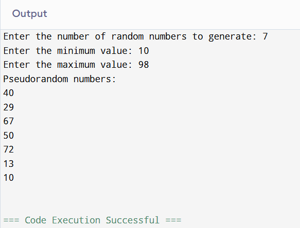

# EX-NO-6-Pseudo-Random-Number

# AIM: 
Implementation of Pseudorandom Number Generation Using Standard library

# ALGORITHM:
Start the program and import the required libraries.
Seed the random number generator using the current time(i.e) rand(time(0));
Get the number of randon number to generate.
Pass the value for number of iterations and print the numbers.
End the program.

# PROGRAM:
```C

#include <stdio.h>
#include <stdlib.h>
#include <time.h>

int main() 
{
    int count, min, max;
    printf("Enter the number of random numbers to generate: ");
    scanf("%d", &count);
    printf("Enter the minimum value: ");
    
    scanf("%d", &min);
    printf("Enter the maximum value: ");
    scanf("%d", &max);
    srand(time(NULL));
    printf("Pseudorandom numbers:\n");   
    for (int i = 0; i < count; i++) 
    {
        int random_number = (rand() % (max - min + 1)) + min;
        printf("%d\n", random_number);
    }
    return 0;
}
```
# OUTPUT:

# RESULT:
The program has been executed successfully